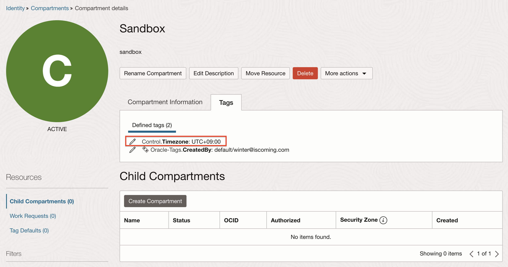

# oci-nightly-stop
[](https://github.com/TheKoguryo/oci-nightly-stop/blob/master/README.md)

밤에 OCI 인스턴스를 종료시킵니다. 그리고 허용되는 환경에서는 데이터베이스 등의 라이센스 모델을 BYOL로 변경시킵니다.

이 프로젝트의 기본 아이디어는 [oci-nigthly-stop](https://github.com/mmarukaw/oci-nigthly-stop)에서 영감을 받았습니다. 원본의 개념을 바탕으로 하였지만, 다양한 서비스를 지원하기 위해 구조를 크게 수정하고 많은 기능을 새롭게 추가하였습니다.

## Nightly Stop을 지원하는 OCI 서비스 목록
- Analytics Cloud
- Compute
- Data Integration
- Data Science
    * Notebook Sessions
    * Model Deployments
- Database
    * Base Database
    * Autonomous Database
- Digital Assistant
- GoldenGate
- HeatWave MySQL
- Oracle Integration 3
- Visual Builder

## BYOL로 라이센스 모델 변경을 지원하는 지원하는 OCI 서비스 목록
- Analytics Cloud
- Database
    * Base Database
    * Autonomous Database
- GoldenGate  
- Oracle Integration 3


## 필수조건
- [OCI SDK for Python](https://docs.oracle.com/en-us/iaas/Content/API/SDKDocs/pythonsdk.htm#SDK_for_Python)
- Python 3.6 and above
    * [Supported Python Versions and Operating Systems](https://docs.oracle.com/en-us/iaas/Content/API/SDKDocs/pythonsdk.htm#pythonsdk_topic-supported_python_versions__SupportedPythonVersionsandOperatingSystems)
- Pre-created oci-cli config file (~/.oci/config)
    * [OCI CLI Quickstart](https://docs.oracle.com/en-us/iaas/Content/API/SDKDocs/cliinstall.htm)

## 사용하는 방법

### 필요한 태그를 추가하는 방법

1. OCI Console로 이동합니다.

2. Root 컴파트먼트에서 Tag Namespaces를 만듭니다.

    - Namespace Definition Name: `Control`

3. Tag Key Definitions을 만듭니다.

    |Tag Key       |Description                             | Tag Value Type|Value                                                      |
    |--------------|----------------------------------------|---------------|-----------------------------------------------------------|
    |`Nightly-Stop`|If FALSE, does not stop at 24:00        | List          |`TRUE`<br> `FALSE`                                         |
    |`BYOL`        |If FALSE, does not change license model | List          |`TRUE`<br> `FALSE`                                         |
    |`Timezone`    |Compartment level tag                   | List          |`UTC+07:00`<br> `UTC+08:00`<br> `UTC+09:00`<br> `UTC+09:30`|

    - 필요하면, Timezone에 필요한 시간대를 더 추가합니다.

4. nightly Stop 대상에서 제외시키고 싶다면, 개별 인스턴스의 태그에 그림과 같이 defined tags를 추가합니다.

    

5. 하나의 테넌시에서 여러 타임존대에 있는 유저들이 사용하는 경우, 타임존에 따라 Nightly Stop을 수행하는 시간을 달리하고 싶으면, 각 Compartment에 defined tags로 `Control.Timezone`을 그림과 같이 추가합니다.

    

### oci-nightly-stop을 실행하는 방법

1. Compute 인스턴스를 만듭니다.

    - 이름: `oci-nightly-stop-vm` 

2. 만든 Compute 인스턴스에 OCI CLI를 설치하고 구성합니다. 그리고 OCI SDK for Python을 설치합니다.

3. 이 리파지토리를 클론합니다.

4. configuration.py 파일을 열어서, 각자에 맞는 환경값을 설정합니다.

5. 실행예시

    - 대상:
    
        * `Control.Timezone: UTC+09:00`가 태그된 Compartment에 속한 모든 인스턴스

        ```$ run_nightly-stop.sh UTC+09:30 include```

    - 대상: 다른 시간대에 스케줄을 수행한 것을 제외하고, 그 이외 모든 대상

        * `Control.Timezone` 태그가 없는 Compartment에 속한 모든 인스턴스
        * Compartment에 `Control.Timezone` 태그가 있고, 그 값이 `UTC+07:00`, `UTC+08:00`, `UTC+09:30`이 아닌 경우, 해당  Compartment에 속한 모든 인스턴스

        ```$ run_nightly-stop.sh UTC+07:00,UTC+08:00,UTC+09:30 exclude```

6. cron에 스케줄을 설정합니다.

    - `crontab -e` 실행

    - 원하는 스케줄을 아래 예시와 같이 추가합니다.

        ```
        ###############################################################################
        # Crontab to run oci-nightly-stop at 24:00 in each time zone
        ###############################################################################
        # UTC+09:30
        30 14 * * * timeout 1h /home/opc/oci-nightly-stop/run_nightly-stop.sh UTC+09:30 include >> /home/opc/oci-nightly-stop/run_nightly-stop.sh_run.txt_`date +\%Y\%m\%d-\%H\%M\%S` 2>&1 

        # UTC+09:00 - If a compartment does not have a timezone tag or is tagged with the remaining timezones, resources belonging to that compartment will be targeted.
        00 15 * * * timeout 1h /home/opc/oci-nightly-stop/run_nightly-stop.sh UTC+07:00,UTC+08:00,UTC+09:30 exclude >> /home/opc/oci-nightly-stop/run_nightly-stop.sh_run.txt_`date +\%Y\%m\%d-\%H\%M\%S` 2>&1
        
        # UTC+08:00
        00 16 * * * timeout 1h /home/opc/oci-nightly-stop/run_nightly-stop.sh UTC+08:00 include >> /home/opc/oci-nightly-stop/run_nightly-stop.sh_run.txt_`date +\%Y\%m\%d-\%H\%M\%S` 2>&1   
        
        # UTC+07:00
        00 17 * * * timeout 1h /home/opc/oci-nightly-stop/run_nightly-stop.sh UTC+07:00 include >> /home/opc/oci-nightly-stop/run_nightly-stop.sh_run.txt_`date +\%Y\%m\%d-\%H\%M\%S` 2>&1                 
       
        ```

### 필요한 OCI IAM 정책

1. 앞서 만든 Compute 인스턴스를 위한 Dynamic Group을 만듭니다.

    - 이름: `oci-nightly-stop-dg`

    - 규칙:

        ```
        All {instance.id = 'the OCID of oci-nightly-stop-vm'}        
        ```            

2. IAM 정책을 만듭니다.

    - 이름: `oci-nightly-stop-policy`

    - 규칙:

        ```
        define tenancy usage-report as ocid1.tenancy.oc1..aaaaaaaaned4fkpkisbwjlr56u7cj63lf3wffbilvqknstgtvzub7vhqkggq
        endorse dynamic-group oci-nightly-stop-dg to read objects in tenancy usage-report
        Allow dynamic-group oci-nightly-stop-dg to inspect compartments in tenancy
        Allow dynamic-group oci-nightly-stop-dg to read usage-report in tenancy
        Allow dynamic-group oci-nightly-stop-dg to inspect domains in tenancy
        Allow dynamic-group oci-nightly-stop-dg to read analytics-instance in tenancy
        Allow dynamic-group oci-nightly-stop-dg to inspect db-systems in tenancy
        Allow dynamic-group oci-nightly-stop-dg to inspect db-nodes in tenancy
        Allow dynamic-group oci-nightly-stop-dg to inspect autonomous-databases in tenancy
        Allow dynamic-group oci-nightly-stop-dg to read instances in tenancy
        Allow dynamic-group oci-nightly-stop-dg to inspect dis-workspaces in tenancy
        Allow dynamic-group oci-nightly-stop-dg to inspect data-science-model-deployments in tenancy
        Allow dynamic-group oci-nightly-stop-dg to inspect data-science-notebook-sessions in tenancy
        Allow dynamic-group oci-nightly-stop-dg to inspect oda-instances in tenancy
        Allow dynamic-group oci-nightly-stop-dg to inspect goldengate-deployments in tenancy
        Allow dynamic-group oci-nightly-stop-dg to read integration-instance in tenancy
        Allow dynamic-group oci-nightly-stop-dg to read mysql-instances in tenancy
        Allow dynamic-group oci-nightly-stop-dg to read visualbuilder-instance in tenancy
        Allow dynamic-group oci-nightly-stop-dg to use analytics-instance in tenancy where request.operation = 'StopAnalyticsInstance'
        Allow dynamic-group oci-nightly-stop-dg to manage analytics-instance in tenancy where request.operation = 'UpdateAnalyticsInstance'
        Allow dynamic-group oci-nightly-stop-dg to manage db-nodes in tenancy where request.operation = 'DbNodeAction'
        Allow dynamic-group oci-nightly-stop-dg to manage db-systems in tenancy where request.operation = 'UpdateDbSystem'
        Allow dynamic-group oci-nightly-stop-dg to use autonomous-databases in tenancy where request.operation = 'StopAutonomousDatabase'
        Allow dynamic-group oci-nightly-stop-dg to use autonomous-databases in tenancy
        Allow dynamic-group oci-nightly-stop-dg to manage autonomous-databases in tenancy where request.operation = 'UpdateAutonomousDatabase'
        Allow dynamic-group oci-nightly-stop-dg to use instances in tenancy where request.operation = 'InstanceAction'
        Allow dynamic-group oci-nightly-stop-dg to manage dis-workspaces in tenancy where any {request.operation = 'StopWorkspace', request.operation = 'GetWorkspace'}
        Allow dynamic-group oci-nightly-stop-dg to manage data-science-model-deployments in tenancy where any {request.operation = 'DeactivateModelDeployment', request.operation = 'GetModelDeployment'}
        Allow dynamic-group oci-nightly-stop-dg to manage data-science-notebook-sessions in tenancy where any {request.operation = 'DeactivateNotebookSession', request.operation = 'GetNotebookSession'}
        Allow dynamic-group oci-nightly-stop-dg to use oda-instances in tenancy where any {request.operation = 'StopOdaInstance', request.operation = 'GetOdaInstance'}
        Allow dynamic-group oci-nightly-stop-dg to use goldengate-deployments in tenancy where request.operation = 'StopDeployment'
        Allow dynamic-group oci-nightly-stop-dg to use goldengate-deployments in tenancy where request.operation = 'UpdateDeployment'
        Allow dynamic-group oci-nightly-stop-dg to use goldengate-deployments in tenancy where request.operation = 'GetDeployment'
        Allow dynamic-group oci-nightly-stop-dg to use integration-instance in tenancy where request.operation = 'StopIntegrationInstance'
        Allow dynamic-group oci-nightly-stop-dg to use integration-instance in tenancy where request.operation = 'UpdateIntegrationInstance'
        Allow dynamic-group oci-nightly-stop-dg to use process-automation-instance in tenancy
        Allow dynamic-group oci-nightly-stop-dg to manage process-automation-instance in tenancy where request.operation = 'UpdateProcessInstances'
        Allow dynamic-group oci-nightly-stop-dg to manage process-automation-instance in tenancy where request.operation = 'UpdateProcessInstance'
        Allow dynamic-group oci-nightly-stop-dg to use mysql-instances in tenancy where request.operation = 'StopDbSystem'
        Allow dynamic-group oci-nightly-stop-dg to use visualbuilder-instance in tenancy where request.operation = 'StopVbInstance'
        Allow dynamic-group oci-nightly-stop-dg to inspect users in tenancy
        Allow dynamic-group oci-nightly-stop-dg to read clusters in tenancy where request.operation = 'GetCluster'
        Allow dynamic-group oci-nightly-stop-dg to read cluster-node-pools in tenancy where request.operation = 'GetNodePool'
        Allow dynamic-group oci-nightly-stop-dg to read desktop-pool in tenancy where request.operation = 'GetDesktopPool'   
        ```
